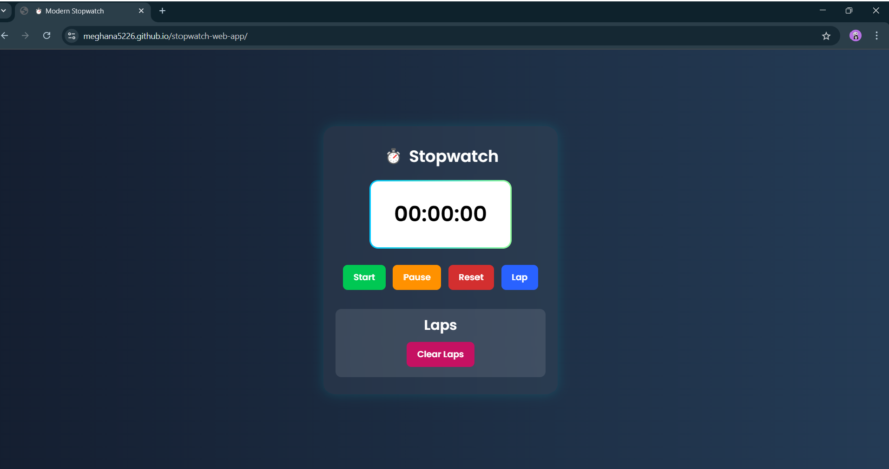

# ⏱️ Stopwatch Web App

A sleek and responsive stopwatch web application built using **HTML**, **CSS**, and **JavaScript**. Perfect for time-tracking tasks, workouts, study sessions, and more!

---

## 🌐 Live Demo

👉 [View Live Stopwatch](https://meghana5226.github.io/stopwatch-web-app/)

---

## ✨ Features

- Start, Stop, Reset functionality
- Lap timer recording (if added)
- Clean and modern UI
- Fully responsive on all devices
- Lightweight & Fast loading

---

## 🛠️ Tech Stack

- HTML5
- CSS3 (Flexbox/Grid)
- JavaScript (ES6+)
- Git & GitHub for version control

---

## 📸 Preview

> 💡 You can replace `preview.png` with a real screenshot of your site.

---

## 📁 Folder Structure

